# Contact state machine

This is a simple proposal for per-finger contact. It describes intended behavior;
z-motion prediction is not part of the live contact pipeline yet.

```mermaid
stateDiagram-v2
    [*] --> Invalid
    Invalid --> Hover: tracking and inputs are valid
    Hover --> PressCandidate: key and knuckle gates pass; z moves down
    PressCandidate --> Pressed: shadow confirms contact
    PressCandidate --> Hover: approach stops without confirmation or retreats
    Pressed --> ReleaseCandidate: z moves up or shadow returns
    ReleaseCandidate --> Pressed: contact evidence returns during grace period
    ReleaseCandidate --> Hover: release confirmed or key/knuckle gate is lost
    Hover --> Invalid: tracking or required inputs become stale
    PressCandidate --> Invalid: tracking or required inputs become stale
    Pressed --> Invalid: tracking or required inputs become stale
    ReleaseCandidate --> Invalid: tracking or required inputs become stale
```

Each finger has its own state and short history.

- **Invalid:** Tracking, calibration, or required eligibility inputs are
  missing or stale. Release an active note immediately. Recovery passes through
  Hover or Ready; it never starts a note directly.
- **Hover:** The finger is tracked, but there is no press in progress. Key
  overlap and knuckle eligibility are required to begin a press candidate.
- **Press candidate:** The finger appears to move down toward a key. In this
  setup, z has been observed to increase as the finger moves down. Show a
  provisional visual highlight while shadow analysis checks for contact.
- **Pressed:** Shadow evidence confirms contact while the key and knuckle gates
  still pass. Send note-on once when entering this state.
- **Release candidate:** The finger appears to move up or the shadow returns.
  Start a short grace period to filter jitter. Return to Pressed if contact
  evidence returns in time; otherwise send note-off once and return to Hover.

In the live implementation, `ready` means the key and knuckle gates pass. It
stays ready when shadow evidence is unknown or stale; neither condition can
start a note. `unavailable` is for missing tracking or required gates. Recovery
checks those gates, moves to `ready`, and lets the ready handler evaluate
shadow evidence on the next state check.

Key overlap and knuckle eligibility gate a press. Z motion predicts a likely
transition; shadow evidence confirms contact. Losing key overlap or knuckle
eligibility releases an active note immediately. Filter z motion per finger and
use separate press and release thresholds so small changes do not make the
state flicker.

The live evaluator uses availability, key overlap, knuckle eligibility, fresh
shadow results, and a short release grace period. `frontend/src/cv/finger.ts`
owns the per-finger state transitions. Its `checkState` method dispatches to
state-specific handlers; `combinedContact.ts` contains the shared state and
gate types plus timing constants. A valid key/knuckle gate recovers an
unavailable finger into `ready`; the ready handler evaluates shadow evidence.
Unknown or stale shadow evidence keeps an otherwise eligible finger ready and
cannot trigger a press. It does not yet use z motion or a distinct press-candidate
state. See
[CV accuracy and performance TODO](CV_TODO.md) for planned work.
